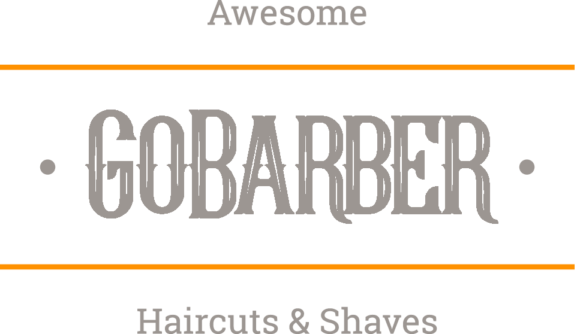
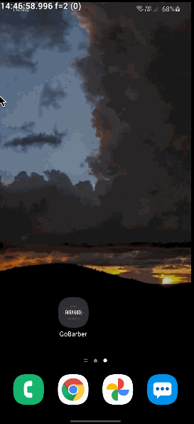

<h2 align="center">
    
</h2>
  
<p align="center">
  

  

  	
  <a href="https://www.linkedin.com/in/gabriel-pereira-oliveira-78b1801ab/">
    
  </a>
	
  
  <a href="https://github.com/Gabrielpdev/GoBarber-Gostack-11/commits/master">
    
  </a>

  
   <a href="https://github.com/Gabrielpdev/GoBarber-Gostack-11/stargazers">
    
  </a>
</p>

<h1 align="center">
  <p align="center">
    
    
  </p>
</h1>


### 📜 Sobre
Projeto desenvolvido durante o **GoStack-11** oferecido pela [Rocketseat] :rocket:.

Este é um projeto de um serviço de gestão de loja de barbearia.
Construído com as tecnologias mais populares do mundo Javascript, este repositório contem uma API REST (Node.js) como backend, uma aplicação em ReactJS como frontend e um app mobile em React Native.

A aplicação em Node.js (backend) é uma API REST escrita em Node.JS que serve dados ao frontend e ao mobile.

A aplicação em ReactJS (frontend) é para o prestador de serviço. Assim podendo visualizar os horários disponíveis de acrodo com o dia selecionado.

A aplicação em React Native é para o cliente. Podendo selecionar um prestador de serviço para marcar um horario.

### :rocket: Começando
```bash
$ git clone https://github.com/Gabrielpdev/GoBarber-Gostack-11.git
$ cd GoBarber-Gostack-11
```
### :rocket: Iniciando com o backend
```bash
$ yarn
# Configure seu .env baseado no .env.example
$ yarn typeorm migration:run
$ yarn dev:server
# server inicializado
```
### 💻 Iniciando com o Front-end 
```bash
$ cd frontend
$ yarn
$ yarn start
```

### 📱 Iniciando com o Mobile (Apenas Android)
```bash
$ cd mobile
$ yarn
$ adb reverse tcp:3333 tcp:3333
$ react-native start
$ react-native run-android
```

### 🧰  Ferramentas utilizadas

As seguintes ferramentas foram usadas na construção do projeto:
- 🔵 [TypeScript][typescript]
- 🟢 [Node Js][nodejs]
- 🔴 [Redis][redis]
- ⚙ [TypeORM][typeorm]
- 🐘 [Postgres][postgres]
- 🌱 [MongoDB][mongodb]
- 👄 [Handlebars][handlebars]
- 📷 [React Native Image Picker][image-picker]
- ⚛️ [React][reactjs]
- ⚛️ [React Native][reactNative]
- 💅 [Styled-components]

Feito com ❤️ por Gabriel Pereira 👋🏽 [Entre em contato!](https://www.linkedin.com/in/gabriel-pereira-oliveira-78b1801ab/)

[image-picker]: https://github.com/react-native-community/react-native-image-picker
[handlebars]: https://handlebarsjs.com/
[mongodb]: https://www.mongodb.com/
[postgres]: https://www.postgresql.org/
[typeorm]: https://typeorm.io/#/
[nodejs]: https://nodejs.org/en/
[redis]: https://redis.io/
[typescript]: https://www.typescriptlang.org/
[reactjs]: https://reactjs.org
[reactNative]: https://reactnative.dev/
[rs]: https://rocketseat.com.br
[Rocketseat]:https://github.com/Rocketseat
[styled-components]:https://styled-components.com/

